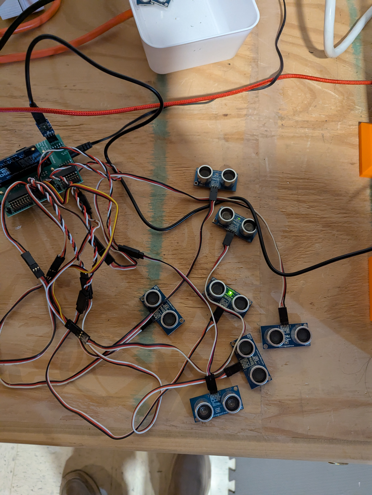
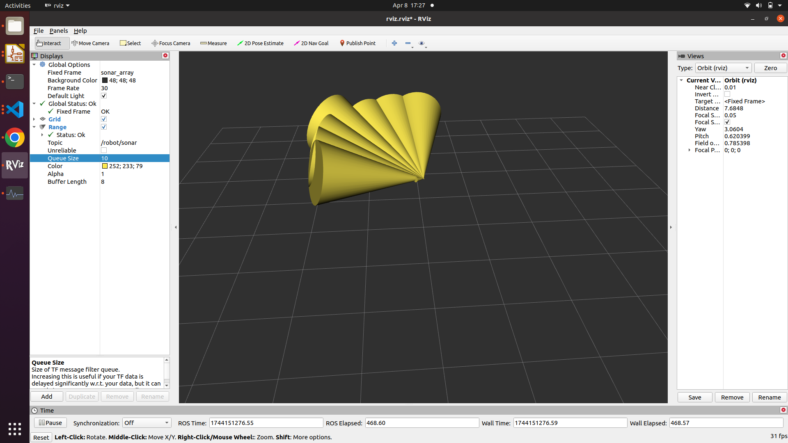

# Sonar Array
__TOC__
- [Overview](#overview)
- [Project Plan](#project-plan)
- [Lexicon](#lexicon)
- [Literature Review](#literature-review)
- [Boards](#boards)
- [Communication](#communication)
- [Sensors](#sensors)
- [Nodes](#nodes)
- [Sonar Array Package](#sonar-array-package)
- [Troubleshooting](#troubleshooting)

## Overview
The Sonar Array project is designed to study and create an advanced sensor array that can use COTS sonar sensors to build a map of a robot's surroundings.

The Sonar Array will be composed of the following:
- Multiple [Parallax Ping Ultrasonic Distance Sensors](doc/Sensors/PingUltraSonicDistanceSensor/PingUltraSonicDistanceSensor.md).
- A mounting hardware design to provide the following mounting options:
  - A fully contained Sonar Array
  - Hardware designed to mount sonar sensors to specific locations on your robot
- Software Driver running on a Board to use the Sonar Sensors, along with a ROS Node that can communicate with the Board that publishes this data over ROS.
- Visualization tools used to see the Sonar Array in action

## Project Plan
| Status | Epic |
| --- | --- |
| STARTED | [Sonar Sensor Characterization](https://dev.azure.com/davidgitz/Sonar%20Array/_workitems/edit/1443) |
| STARTED | [Sonar Array Driver](https://dev.azure.com/davidgitz/Sonar%20Array/_workitems/edit/1438) |
| NOT STARTED | [Sonar Array Hardware Design & Build](https://dev.azure.com/davidgitz/Sonar%20Array/_workitems/edit/1442) |
| NOT STARTED | [Sonar Array Simulation](https://dev.azure.com/davidgitz/Sonar%20Array/_workitems/edit/1445) |
| NOT STARTED | [Sonar Array Driver Optimization](https://dev.azure.com/davidgitz/Sonar%20Array/_workitems/edit/1439) |
| NOT STARTED | [RVIZ Sonar Array Plugin](https://dev.azure.com/davidgitz/Sonar%20Array/_workitems/edit/1440) |
| NOT STARTED | [Occupancy Grid](https://dev.azure.com/davidgitz/Sonar%20Array/_workitems/edit/1441) |
| NOT STARTED | [Sonar Array Driver Scan/Ping Pattern Automation](https://dev.azure.com/davidgitz/Sonar%20Array/_workitems/edit/1444) |

## [Lexicon](Lexicon.md)
## [Literature Review](doc/LiteratureReview/LiteratureReview.md)
## [Boards](doc/Boards/Boards.md)
## [Communication](doc/Communication/Communication.md)
## [Sensors](doc/Sensors/Sensors.md)
## [Nodes](doc/Nodes/Nodes.md)

## Sonar Array Package

## [Troubleshooting](doc/Troubleshooting/Troubleshooting.md)