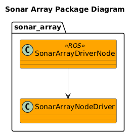

# Sonar Array
__TOC__
- [Overview](#overview)
- [Project Plan](#project-plan)

## Overview
The Sonar Array project is designed to study and create an advanced sensor array that can use COTS sonar sensors to build a map of a robot's surroundings.

## Project Plan
| Status | Epic |
| --- | --- |
| STARTED | [Sonar Sensor Characterization](https://dev.azure.com/davidgitz/Sonar%20Array/_workitems/edit/1443) |
| NOT STARTED | [Sonar Array Driver](https://dev.azure.com/davidgitz/Sonar%20Array/_workitems/edit/1438) |
| NOT STARTED | [Sonar Array Hardware Design & Build](https://dev.azure.com/davidgitz/Sonar%20Array/_workitems/edit/1442) |
| NOT STARTED | [Sonar Array Simulation](https://dev.azure.com/davidgitz/Sonar%20Array/_workitems/edit/1445) |
| NOT STARTED | [Sonar Array Driver Optimization](https://dev.azure.com/davidgitz/Sonar%20Array/_workitems/edit/1439) |
| NOT STARTED | [RVIZ Sonar Array Plugin](https://dev.azure.com/davidgitz/Sonar%20Array/_workitems/edit/1440) |
| NOT STARTED | [Occupancy Grid](https://dev.azure.com/davidgitz/Sonar%20Array/_workitems/edit/1441) |
| NOT STARTED | [Sonar Array Driver Scan/Ping Pattern Automation](https://dev.azure.com/davidgitz/Sonar%20Array/_workitems/edit/1444) |

## [Sensors](doc/Sensors/Sensors.md)

## Sonar Array Package

