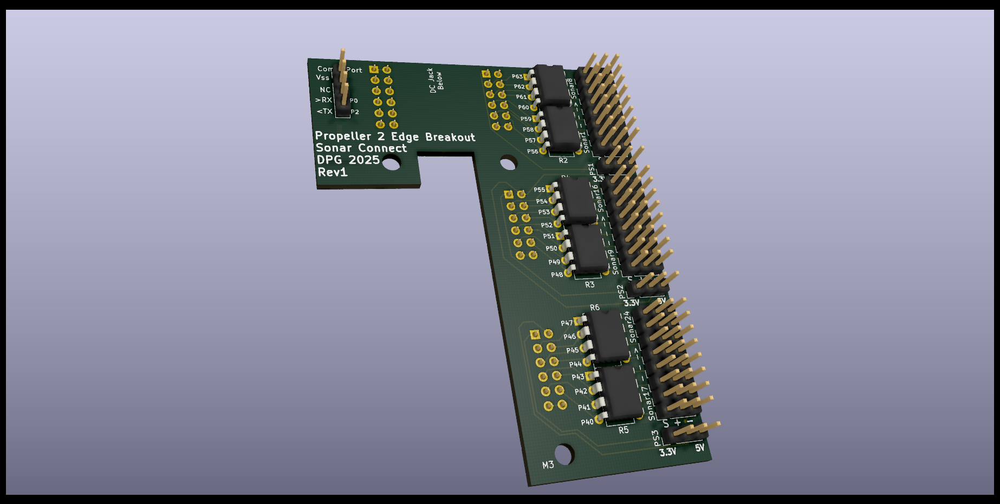

[Boards](../Boards.md)
# Connect Board
The Connect Board provides the GPIO connections necessary to connect multiple Sonar's to the Parallax Propeller.

## ToDo List
| Status | ToDo |
| --- | --- |
| OK | Check Shunt Size/Footprint |
| OK | Resistor Footprint |
| OK | Board Mounting Holes |
| OK | Prop Pin Connection Names |
| OK | Fine tune Footprint connections to Edge Breakout Board |
| OK | Verify Footprint: 2 x 6 Connector |
| OK | Verify Footprint: Resistor |
| | Fix Edge Switches to run content even if debug port is connected at startup |
| OK | Change individual resistors to resistor array |
| OK | Fix silkscreen |
| | PCB Manufacturer ERC Rules |
| | Verify Standoff/Height connection (include check for DC Barrel Jack)
| | Test Print PCB |

## Bill Of Materials 
| On-Hand? | Part | Quantity | Description |
| --- | --- | --- | --- |
| YES | 1x3 Vertical Header-Male | 27 | Headers for Sonars and PS Connections |
| NO | 2x6 Vertical Header-Female | 3 | Headers for Propeller 2 |
| YES | 1x4 Vertical Header-Male | 1 | Prop Plug Comm Port |
| NO   | M3x? Standoff | 3 | Standoffs for Sonar Connect Board |
| NO | 4 Resistor 8pin DIP Network Isolated | 6 | Resistor Network.  Can substitute for 3 16pin DIP 8 Resistors package.  [part](https://www.bourns.com/docs/Product-Datasheets/4100R.pdf) |

## Requirements
| Requirement | Description |
| --- | --- |
| Connect up to 24 Sonars | GPIO connection for up to 24 Sonars |
| Propeller Pin Protection | 4.7k Ohm Resistor on every Sonar Signal Pin. |
| Connect groups of 4 Sonars | 3 Banks of 8 Sonars |
| Signal protection disable resistor | Able to disable signal protection resistor per 8-bank |
| Secure connection | Secure connection to Propeller 2 |
| 3.3V/5V Select | Jumper selector for each 8-bank |
| Comm Port | Has 4-pin comm port connection to Raspeberry Pi |

## Electrical Design

- [Connect Board Schematic](elec/ConnectBoard/ConnectBoardSchematic.pdf)
- [Connect Board PCB](elec/ConnectBoard/ConnectBoardPCB.pdf)