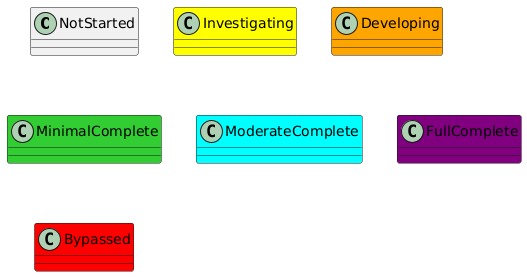
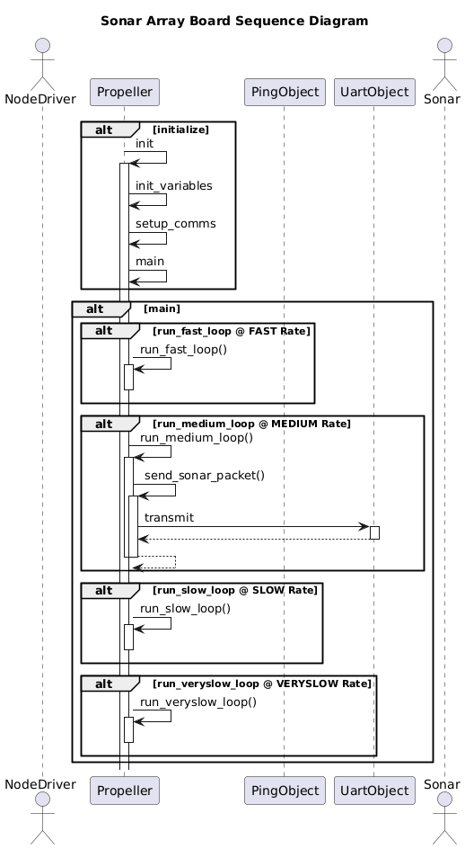

[Boards](../Boards.md)

# Parallax Propeller 2

## Board Driver
The Board Driver is software based on a Paral

### Software Design

#### Sequence Diagram

## Dependencies

|Dependency                                                                                                                     |
| --- |
| [jm_full_duplex_serial](https://github.com/parallaxinc/propeller/tree/master/libraries/community/p2/All/jm_full_duplex_serial) |

## References
| Reference                                                        | Description                                   |
| --- | --- |
| [Spin Language](../../LiteratureReview/ref/Propeller2/ProgrammingLanguage/Parallax%20Spin2%20Documentation%20v50.pdf)  | Spin Language Documentation                   |  |
| [Spec Sheet](../../LiteratureReview/ref/Propeller2/Hardware/P2X8C4M64P_Propeller-2-Spec-Sheet_20211013.pdf) | Quick Spec Sheet.  General Features.          |
| [Data Sheet](../../LiteratureReview/ref/Propeller2/Hardware/Propeller2-P2X8C4M64P-Datasheet-20221101.pdf) | Data Sheet.  Design, Registers, etc.          |
| [Hardware Manual](../../LiteratureReview/ref/Propeller2/Hardware/Propeller-2-Hardware-Manual-20221101.pdf) | Hardware Manual.  Thorugh User documentation. |

## Propeller 2 Object Exchange Forum Relevant Posts 
- [Load spin1 object in spin2 code](https://forums.parallax.com/discussion/176154/possible-to-load-a-spin1-object-in-a-spin2-top-level-object#latest)