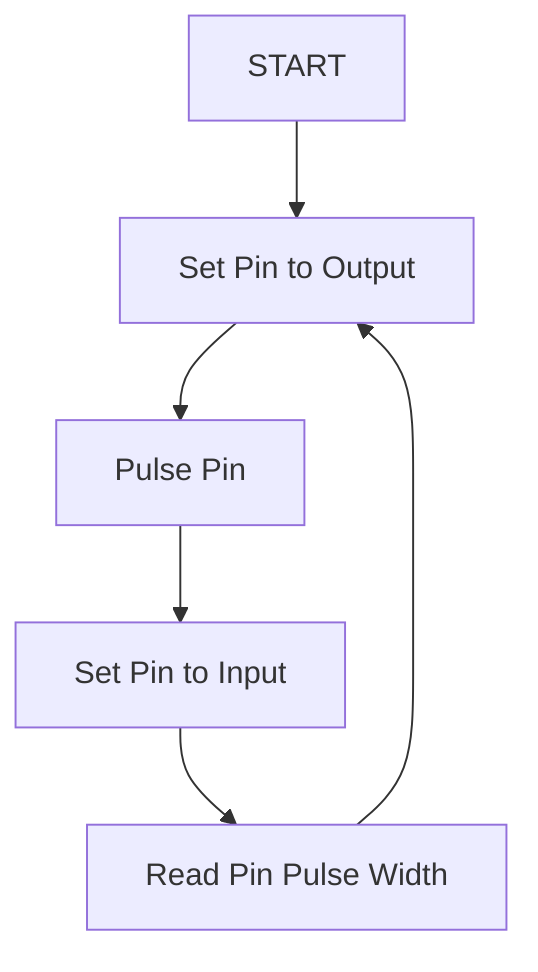
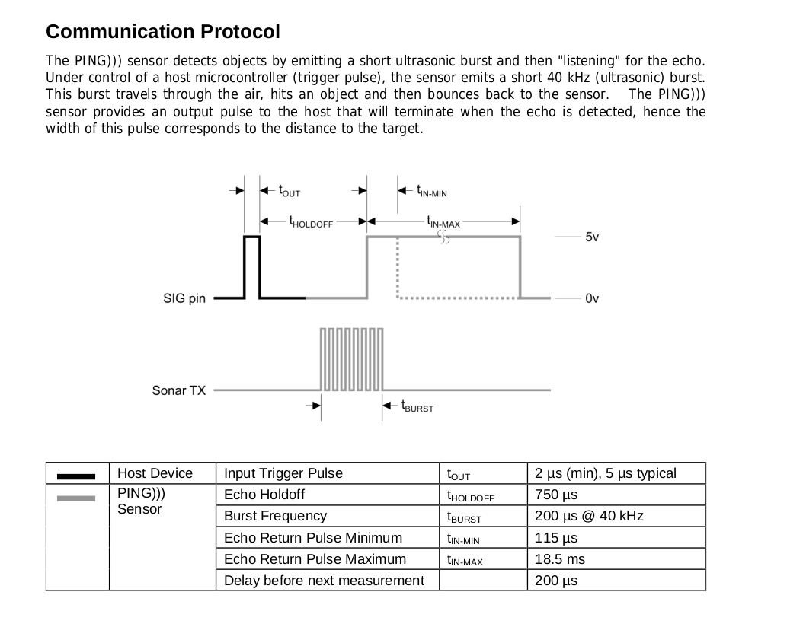

[Communication](../Communication.md)
# Board to Sensor Comms
The Sonar Sensor currently selected (Parallax Ping Ultrasonic Sensor) follows a defined communication protocol that uses 1 pin on a microcontroller.  

## Overview
Typically the pin would be triggered in the following method (at a high level)

## Specification
The actual specification for this protocol is defined here:
