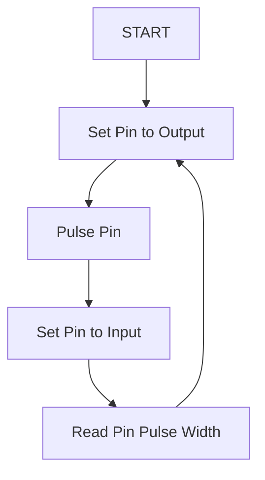

[Communication](../Communication.md)
# Board to Sensor Comms
The Sonar Sensor currently selected (Parallax Ping Ultrasonic Sensor) follows a defined communication protocol that uses 1 pin on a microcontroller.  

## ToDo
| ToDo |
| --- |
| Update driver to support milli-meter units instead of centimeter? |

## Questions
| Question | Answer |
| --- | --- |
| Does Ping Propeller Object observe tDelay? | No. |
| How long does it take to go from tOut to tBurst? |

## Optimization Areas
| Potential Optimization |
| --- |
| If SonarA and SonarB have overlapping Beams, SonarB can start as soon as In Pulse for Sonar A is done (doesn't need to wait for tDelay). |
| Ping's can be done in their own loop, instead of polled.  Worst case this will be at 50 Hz, potentially at higher rates. |
| Max tIn Pulse time appears to be almost double max distance supported by sensor.  Possible to exit pulse in wait early to speed up? |
| Speed up tIn measurement for objects at max distance supported in sensor. |

## Overview
Typically the pin would be triggered in the following method (at a high level)

## Specification
The actual specification for this protocol is defined here:

According to this specification, the following parameters exist on a typical Ping Sonar:
| Specification | Value | Description |
| --- | --- | --- |
| Min Distance Ping Time | 1070 uS | Time to perform a full measurement for an object at the minimum distance supported. |
| Max Distance Ping Time | 19455 uS | Time to perform a full measurement for an object at the maximum distance supported. |
| Min Distance Ping Rate | 934.58 Hz | Rate to perform a full measurement for an object at the minimum distance supported. |
| Max Distance Ping Rate | 51.4 Hz | Rate to perform a full measurement for an object at the maximum distance supported. |

## References
- [Full Ping Sonar Specification](../../LiteratureReview/ref/SonarSensor/Hardware/28015-PING-Sensor-Product-G.pdf)