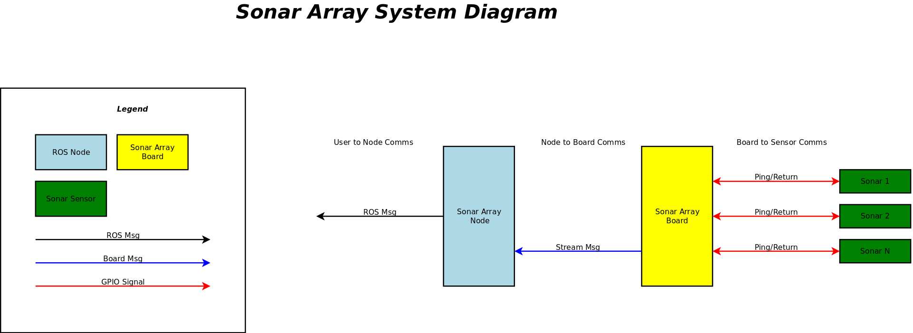

[Home](../../README.md)

# Communication

## Overview
The Sonar Array has the following Communications Protocols
| Usage | Name |
| --- | --- |
| Board <--> Sensor | [BoardToSensor](BoardToSensor/BoardToSensor.md) |
| Node <--> Board | [NodeToBoard](NodeToBoard/NodeToBoard.md) |
| User <--> Node | [UserToNode](UserToNode/UserToNode.md) |

## Comms Design

## References
- https://www.raspberrypi.com/documentation/computers/configuration.html#configure-uarts
