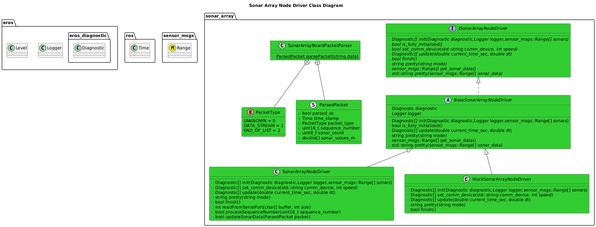
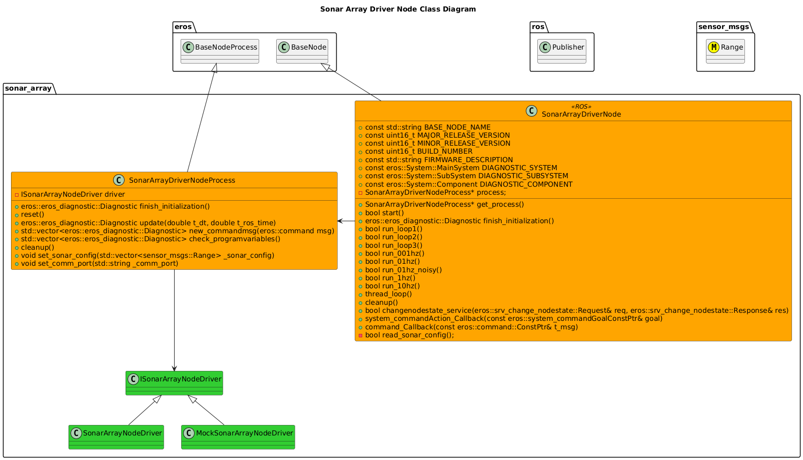
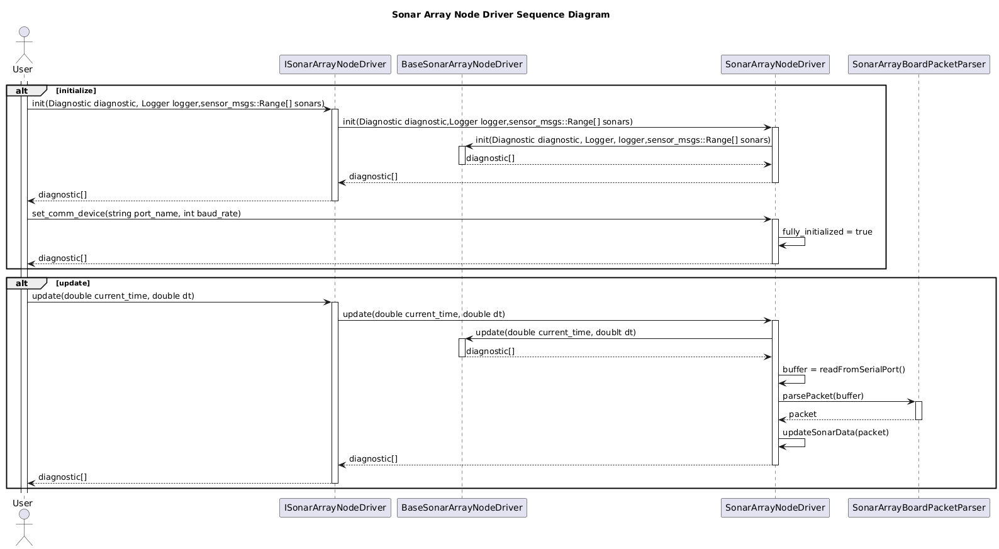
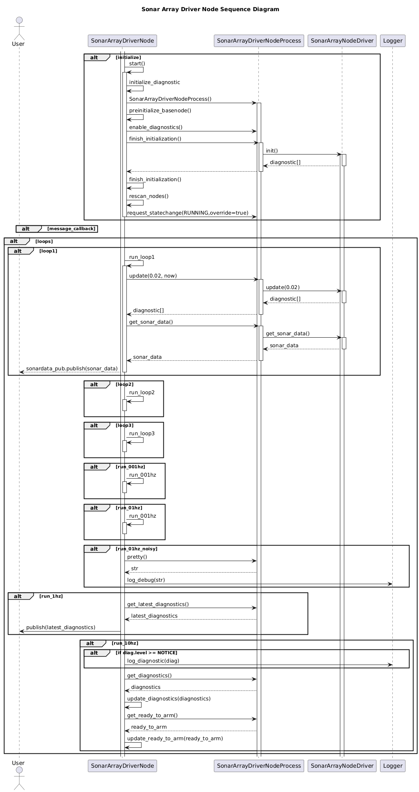

[Nodes](../Nodes.md)
# Sonar Array Node
## How It Works

## Setup Instructions


## Usage Instructions
### Sonar Array Node

#### Configuration


### Test Driver
A Test Executable for the Sonar Array Node Driver can be ran by running:
```bash
/install/bin/exec_servohat_driver
```

A Test Executable for the GPS Hat Driver can be ran by running:
```bash
/install/bin/exec_servohat_driver
```
This will give output similiar to:
```bash
Tester for Sonar Array Node Driver
-h This Menu.
-d Device.  Default: /dev/ttyUSB0
-s Sonar Count. Default: 20
-l Logger Threshold. [DEBUG,INFO,NOTICE,WARN,ERROR]

```

Examples:
```
./install/bin/exec_sonararray_node_driver -d /dev/ttyUSB0 -s 20 -l DEBUG
```


## Software Design
### Class Diagrams




### Sequence Diagrams



## Diagnostics Strategy
| Status | Diagnostic Type | Message | Level | Description |
| --- | --- | --- | --- | --- |
| DONE | COMMUNICATIONS | INITIALIZING | INFO | Set when Comms with Sonar Array are initializing. |
| DONE | COMMUNICATIONS | INITIALIZING_ERROR | ERROR | Set when the Comms port to the Sonar Array can't be initialized. |
| READY | COMMUNICATIONS | DEVICE_NOT_AVAILABLE | ERROR | Set when Comm Port becomes unavailable. |
| DONE | COMMUNICATIONS | NOERROR | INFO | Set when no error is present. |
| READY | DATA_STORAGE | INITIALIZING | INFO | Set when Driver is initializing configuration. |
| DONE | DATA_STORAGE | INITIALIZING_ERROR | ERROR | Set when Driver can't initialize configuration. |
| DONE | DATA_STORAGE | NOERROR | INFO | Set when no error is found with Data Storage. |
| DONE | SENSORS | INITIALIZING | INFO | Set when Sensors are Initializing. |
| DONE | SENSORS | DROPPING_PACKETS | WARN | Set when Sensor Array is missing data. |
| DONE | SENSORS | DEVICE_NOT_AVAILABLE | ERROR | Set when Sonar Array becomes unavailable. |
| DONE | SENSORS | NODATA | ERROR | Set when no Sensor data has been received. |
| READY | SENSORS | NOERROR | INFO  | Set when no error is present with Sensors. |
| READY | SOFTWARE | INITIALIZING | INFO | Set when Software is Initializing. |
| DONE | SOFTWARE | INITIALIZING_ERROR | ERROR | Set when there is an error in initialization. |
| DONE | SOFTWARE | NOERROR | INFO | Set when no Error is found with Software. |
| READY | SYSTEM_RESOURCE | INITIALIZING | INFO | Set when Driver is initializing System Resource monitoring. |
| READY | SYSTEM_RESOURCE | INITIALIZING_ERROR | ERROR | Set when Driver can't initialize System Resource monitoring. |
| READY | SYSTEM_RESOURCE | NOERROR | INFO | Set when no error is present with System Resource monitoring. |