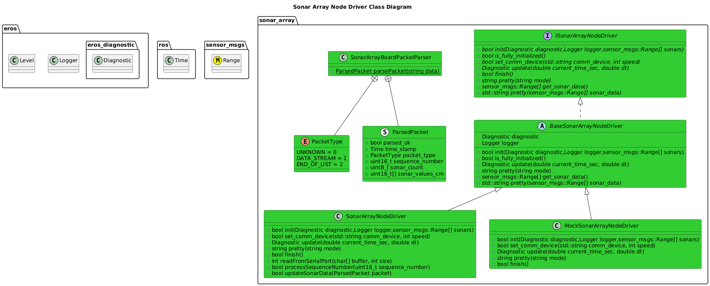
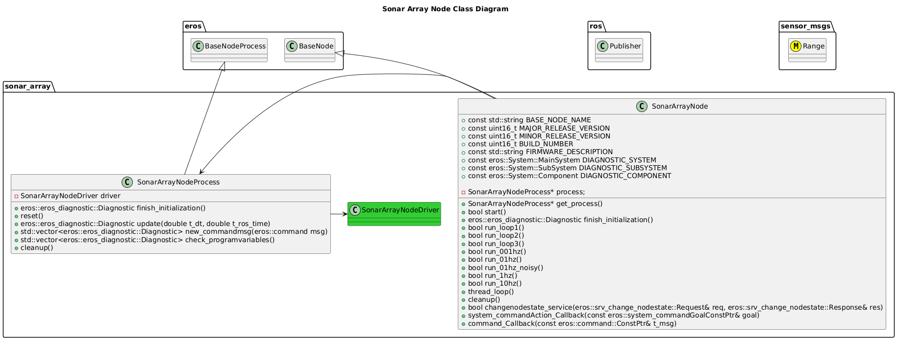
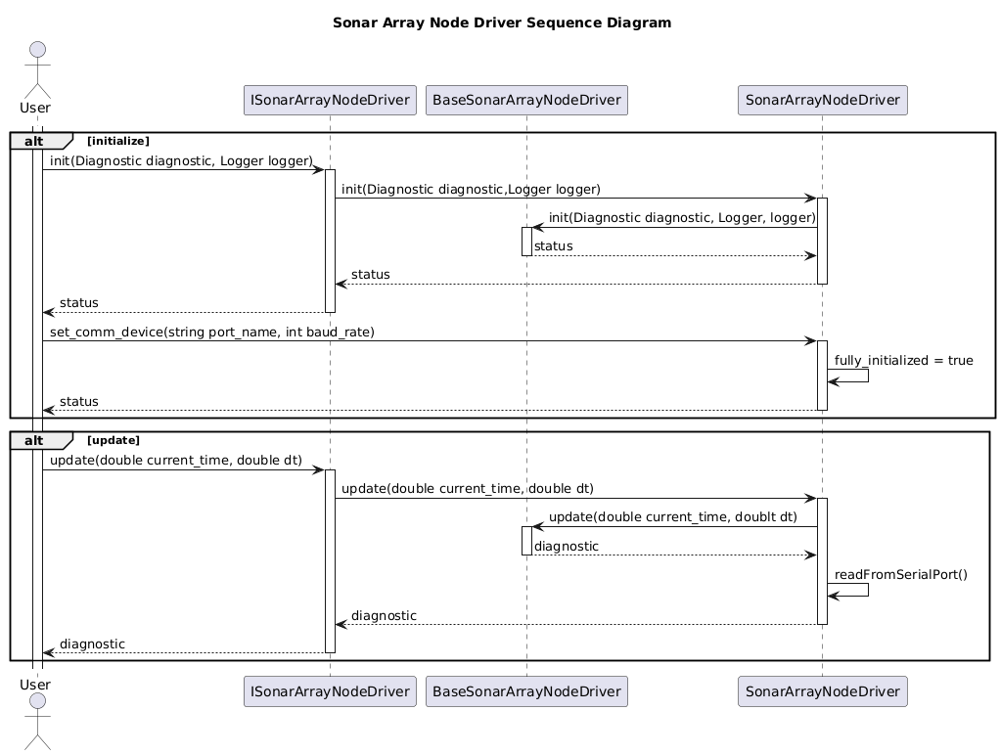
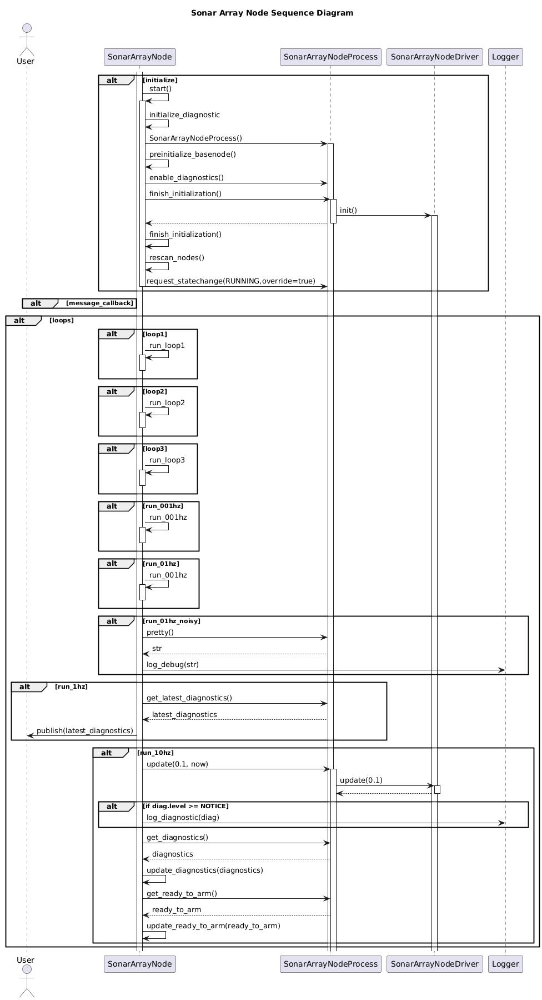

[Nodes](../Nodes.md)
# Sonar Array Node
## How It Works

## Setup Instructions


## Usage Instructions
### Sonar Array Node

#### Configuration


### Test Driver
A Test Executable for the Sonar Array Node Driver can be ran by running:
```bash
/install/bin/exec_servohat_driver
```

A Test Executable for the GPS Hat Driver can be ran by running:
```bash
/install/bin/exec_servohat_driver
```
This will give output similiar to:
```bash
Tester for Sonar Array Node Driver
-h This Menu.
-d Device.  Default: /dev/ttyUSB0
-s Sonar Count. Default: 20
-l Logger Threshold. [DEBUG,INFO,NOTICE,WARN,ERROR]

```

Examples:
```
./install/bin/exec_sonararray_node_driver -d /dev/ttyUSB0 -s 20 -l DEBUG
```


## Software Design
### Class Diagrams




### Sequence Diagrams

